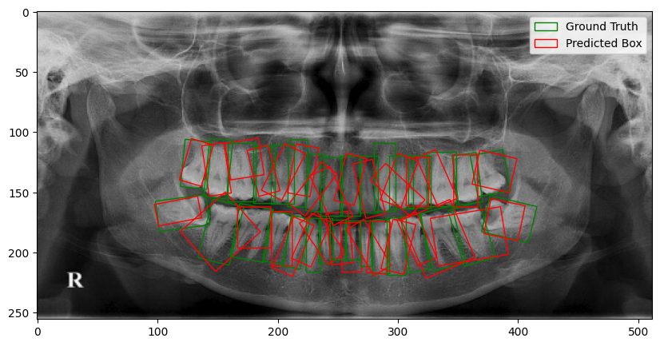

# Tooth Detection System  

This project implements a deep learning–based object detection system designed to identify tooth position, orientation, and classification from dental imagery. The approach adapts methods from remote sensing object detection research to the domain of dentistry.  

## 🔍 Overview  
- Implemented an **object detection algorithm** based on a modified **Single Shot MultiBox Detector (SSD)**, inspired by:  
  - *Tianyu Tang et al. (2017). Arbitrary-Oriented Vehicle Detection in Aerial Imagery with Single Convolutional Neural Networks*.  
  - Published in *MDPI Journal of Remote Sensing*.  

- Managed the **end-to-end project lifecycle**, including:  
  - Data acquisition  
  - Model development  
  - Validation  

- Built a system capable of detecting:  
  - Tooth position  
  - Tooth orientation  
  - Tooth classification  

## 🗂 Dataset  
- A **specialized dental dataset** was annotated in collaboration with a dental expert.  
- Annotation performed using **[CVAT](https://cvat.org/) (Computer Vision Annotation Tool)**.  
- Ensured high-quality **ground truth data** for robust training and evaluation.  

## 🚀 Key Features  
- Adaptation of **arbitrary-oriented object detection** methods for dental imaging.  
- High-quality dataset with expert-driven annotations.  
- Scalable pipeline for training and validating detection models.  

## 📌 Applications  
- Automated dental analysis  
- Pre-processing for orthodontic treatment planning  
- Computer-aided diagnosis  

## 🖼 Example Results  
You can visualize the detection results here. Add your image to the **results/** folder and update the path below:  

  
